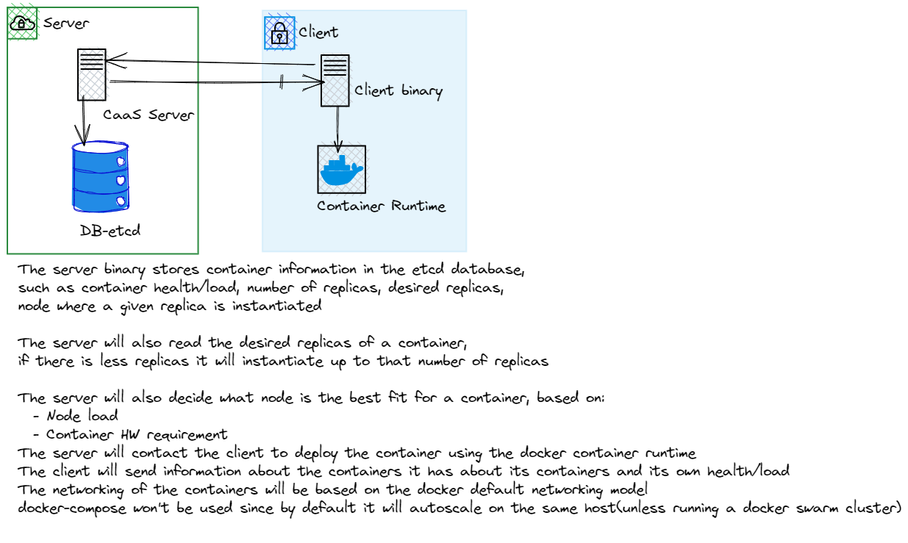

# OpenCaaS (WIP)

OpenCaaS is a backend platform, that will be used to automatically deploy containers on a set of nodes(could be VMs or bare metal as long as they are running a linux os)
- will use the Docker SDK for go to do the different tasks such as creating containers, scaling a container, removing a container
- need to have an etcd database instantiated where the information of the nodes and containers will be stored
- will consists on 2 binaries one for the server and one for the client both will be a webserver to allow an easy of communication and an ease of automation for the deployment and container OPS
- The server will connect to the etcd db to read and write information in it, such as container name, number of replicas, node where its deployed, etc...
- In order for the application to work docker server needs to be initialized, to do so follow the next [guide](https://medium.com/@ssmak/how-to-enable-docker-remote-api-on-docker-host-7b73bd3278c6)

tl;dr 

Open /lib/systemd/system/docker.service and edit in the file the line that starts with ExecStart and appent to it -H=tcp://0.0.0.0:2375

The port could be any port but take into it into account when you set up the config.json file for the client binary

## Architecture
This is the application architecture on a high level standpoint
 

